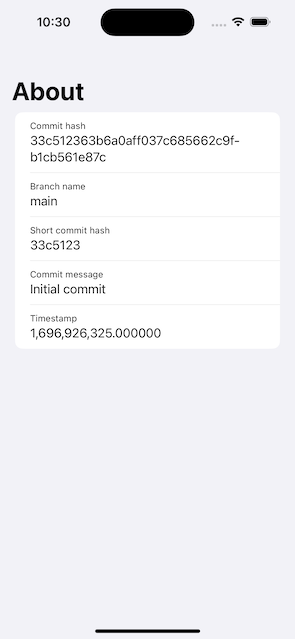
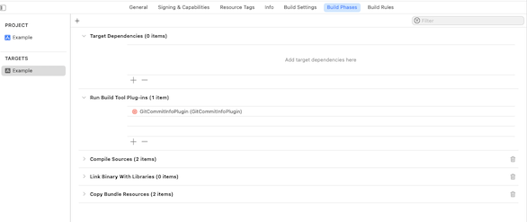

# GitCommitInfoPlugin


GitCommitInfoPlugin is a simple to use Swift package build plugin that allows you to display basic information from the last git commit. You can use it to prepare info view about current commit for QA team or prepare what's new view based on the commit message.

## Requirements

Xcode 14 or above

## Usage

1. Add dependency `File -> Add Package Dependencies` enter url to github repo.
2. Add Plugin to your target in section `Build Phases -> Run Build Tool Plug-ins`

3. Access properties from `GitCommitInfo` in your view.

```swift
import SwiftUI

struct ContentView: View {
    var body: some View {
        NavigationStack {
            List {
                VStack(alignment: .leading) {
                    Text("Commit hash").font(.caption)
                    Text(GitCommitInfo.commitHash)
                }
                VStack(alignment: .leading) {
                    Text("Branch name").font(.caption)
                    Text(GitCommitInfo.branchName)
                }
                VStack(alignment: .leading) {
                    Text("Short commit hash").font(.caption)
                    Text(GitCommitInfo.shortCommitHash)
                }
                VStack(alignment: .leading) {
                    Text("Commit message").font(.caption)
                    Text(GitCommitInfo.commitSubject)
                }
                VStack(alignment: .leading) {
                    Text("Timestamp").font(.caption)
                    Text("\(GitCommitInfo.unixTimestamp)")
                }
            }.navigationTitle("About")
        }
    }
}
```
## License

MIT
